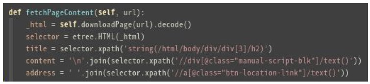

# easySearch line bot
> This is simple line api based bot using QANet-SQUAD-1.
> The base for chatbot replying are the articles fetched from a travel website.
> Due to privacy and policy of the travel website, the data canot be shared without permission so you can fetch your own, > The sample code is given below (Under Extracting data source)

[![npm][namee here ]][url here]


## Installation

OS X & Linux:

```sh

```

Windows:

```sh

```

## Usage example

A few motivating and useful examples of how your product can be used. 

## Development setup

Install all development dependencies, check by using 
> SQLite Database (with Peewee Model Support)
> FastText pre-trained word embedded model in pymagnitude format
> k-nn search (powered by Annoy python module)
> Line Bot API
> RESTful linked protocol
> data from a travel web source
> use  "pip freeze > requirements.txt" to save and intall the required dependencies


## Other requirements 
>  Download pre-trained wiki-news-300d-1M-subword.magnitude (remeber to use pymagnitude format) 
>  Use Annoy toolkit for fast Nearest Neighbor search on vector space 
>  The search will get the article with content close to the question from the user. This may not be the answer to the question. Therefore, use QANet to process this article.
> QANet model would do tokenization and predict the response span by context/question embedding
> LXML (Python Module)
> XPATH Method

## Line messeging api 
> create a line messeging bot based on line messageing api for tbat you can refer to this article 
> This will help you to go build your own line bot from begining to end 
> [Build a line bot]: https://ithelp.ithome.com.tw/articles/10235146

## Release History

* 1.0.0
    * CHANGE: Updated basic implementation (module code remains unchanged)

## Extracting data source 
* To extract the data use this screenshot as the reference of the code that i havent included in the github


## Article search 
* In order to make good use of data, I did a word-vector to article-vector conversion.
* This is done by TF-IDF weighted mean for all words in an article. (Except stopword, I
* use the stopwords list from nltk)


## Contributing

1. Fork it (<https://github.com/yourname/yourproject/fork>)
2. Create your feature branch (`git checkout -b feature/fooBar`)
3. Commit your changes (`git commit -am 'Add some fooBar'`)
4. Push to the branch (`git push origin feature/fooBar`)
5. Create a new Pull Request


<!-- Markdown link & img dfn's -->

[npm-url]: https://npmjs.org/package/datadog-metrics


Your Name – [@tatheerhussain](https://twitter.com/tatheerhussain) 